# RunTime: A Transformer Framework for Distributional Regression on Event Sequences (and Beyond)

**Author:** Yael S. Elmatad  
**Date:** January 21, 2026  
**Focus:** Distributional regression and forecasting for event sequences (TPP-aligned), with extensions to standard regression and regularly-sampled time series

**License (this document):** Creative Commons Attribution 4.0 International (CC BY 4.0). See `LICENSE-CC-BY-4.0`.

---

## Abstract

Predicting outcomes in irregular systems—whether stochastic, intermittent, or state-based—is traditionally treated as a snapshot problem. Classical approaches take a collection of static features and regress a point estimate for the next state. This approach fundamentally ignores the **temporal cadence** and the **distribution of potential**.

**What is RunTime?** **RunTime** is a causal Transformer framework for **irregular event trajectories** (closely related to Temporal Point Processes, TPPs). It represents each event as a fixed-stride token block and treats **time deltas as first-class tokens**, training with **Gaussian-integrated soft targets** so the model predicts a full probability distribution over outcomes rather than a single point estimate.

Although presented through the lens of **TPPs** and irregular-event sequences, the same architectural ingredients apply to **standard supervised regression** and to **regularly-sampled time-series forecasting** (fixed-interval grids). In practice, this positions distributional sequence models like RunTime as credible drop-in competitors to strong tabular and classical forecasting baselines (e.g., **XGBoost**, **ARIMA**) while retaining mechanistic auditability via attention/activation inspection.

**Why does it matter?** Predicting a **distribution** (a PDF over discretized bins) enables uncertainty-aware decisions and avoids the brittleness of point-estimate regression in noisy, irregular systems.

**What does it achieve?** On a high-fidelity benchmark of **600,000+ trajectories** and **5M+ training examples**, RunTime achieves **37.10s MAE** compared to a tuned XGBoost result of **40.94s** (a 3.84-second or **9.35% improvement**) on **entity-disjoint (unseen-runner)** evaluation splits. These numbers reflect initial, untuned RunTime experiments; ongoing hyperparameter sweeps are expected to widen the gap as tuning effort is matched to the tabular baseline.

## Priority Claims

This document establishes priority for the following contributions:

1. **Architectural**: A causal Transformer grammar for irregular event sequences that discretizes environmental features while treating inter-event time as a continuous token.
2. **Methodological**: Gaussian-integrated soft targets that preserve ordinal relationships between discretized bins, enabling robust distributional regression.
3. **Empirical**: Initial demonstration that RunTime beats tuned XGBoost on entity-disjoint splits over 600K+ individuals and 5M+ training examples.
4. **Dataset & Pipeline**: Timestamped data shards, vocabulary definitions, and a reproducible pipeline with entity-level splits.

Work-in-progress status: detailed follow-ups are catalogued in Section 8.

## Document Status (January 2026)

**Completed:** architecture design, Gaussian smoothing implementation, initial 30-epoch training run, benchmark against XGBoost, interpretability figures, documentation.

**In progress:** hyperparameter sweeps, ablations (discretization vs continuous features, time-token contribution), sweep checkpointing, W&B logging.

**Planned:** heterogeneous-event grammars, zero-history comparisons, external validation (e.g., MIMIC-IV). This document is shared to establish priority while inviting collaboration.

---

## Probabilistic Discretization for Transformers

Chronos-et-al demonstrate that Transformers are powerful on **regular, fixed-interval time series** when each timestep is already on a uniform grid. The secret sauce there is **discretizing the prediction horizon** (e.g., hourly slots) and training the Transformer to output a categorical distribution over that grid. RunTime adopts the same probabilistic discretization hypothesis but extends it to the far more demanding regime of **irregular temporal point processes** (TPPs) where the interval between events can vary from days to years.

Each event is still encoded as a fixed-size token block, but, unlike Chronos, the sequence is not uniformly spaced; the gaps between events are informative and change how the predictive distribution should behave. To keep the Transformer honest we pair that discretization with **Gaussian-smoothed targets** over pace. Chronos uses hard cross-entropy with one-hot labels, which places zero mass on nearby bins. Our softened targets (see Section 1.D) deliver smooth gradients, better-calibrated uncertainty, and graceful interpolation across neighboring bins.

This combination—discretizing states while modeling irregular cadence—keeps the best of Chronos (discrete vocabularies + softmax) while unlocking point processes that are closer to real-world event systems.

## Why Tabular Transformers Fail

Recent benchmarks emphasize that tabular-specific Transformers struggle to leave tree-based baselines behind consistently.
Gorishniy et al. (2021) revisit the FT-Transformer and conclude there is still no universally superior solution—on some datasets XGBoost outperforms the Transformer, while on others the FT-Transformer is competitive or superior.
Huang et al. (2020) introduce the TabTransformer and report it matching tree-based ensembles on average AUC, again failing to reliably eclipse them.
Google’s TabNet (Arik & Pfister 2019, AAAI 2021) likewise claims selective wins over gradient boosting, but the gains only appear on specific tasks and depend on the dataset-specific regimes.
Taken together, these studies suggest that Transformers—with smooth embeddings and continuous feature maps—struggle to capture the sharp, regime-specific behavior that trees learn implicitly through splits. Trees already behave like implicit binning, so the extra modeling freedom of attention is often insufficient to compensate.

Tabular Transformer variants (TabNet, FT-Transformer, TabTransformer, etc.) often promise to beat gradient-boosted trees by combining attention with continuous embeddings. In practice, they rarely do unilaterally. The reason is simple: **decision trees already implement an implicit binning regime via splits**, which creates sharp, regime-specific behaviors (e.g., “if age > 45 then ...”). Neural networks with embedded continuous features instead learn smooth functions, so they struggle to represent those abrupt regime boundaries and tend to hedge toward the mean.

Even when attention is added, the model inherits the same smoothness bias. The Transformer cannot easily express the discrete regimes that trees discover because it has no explicit binning mechanism. As a result, these Transformer-based tabular architectures often still fall behind **XGBoost** on structured problems, despite their additional complexity.

## Why Not Continuous Embeddings?

Literature reports that purely continuous embeddings—letting the Transformer consume raw float-valued features (temperature, humidity, distance, etc.)—tend to behave like the **Gorishniy et al. (2021) FT-Transformer**: the model learns a smooth approximation of the conditional mean and the distribution collapses into a narrow peak. Cross-entropy gradients, when tied to point outputs, reward tiny shifts in mean but not the structure of uncertainty.

The problem is that continuous embeddings by themselves cannot represent **regime shifts** or capture the multi-modal PDFs that real-world irregular systems produce. The gradient becomes dominated by the safest path and the model forgets how to express tails. By **quantizing the inputs and outputs into bins before the Transformer**, we reintroduce the discrete regimes that tree-based models exploit while still leveraging attention within each regime. This explicit binning is the difference between a smooth function and a distributional recipe.

Shwartz-Ziv & Armon (2022) argue that deep learning fails on tabular data precisely because it learns smooth, linearizable surfaces, whereas trees perform axis-aligned splits that act like sharp, regime-based discretizers. Grinsztajn et al. (2022) echo this: tree-based models outperform neural nets because they can immediately carve the input space into different behaviors. These studies reinforce our decision to **explicitly discretize** certain features before feeding them to the Transformer, which allows the model to reason over discrete regimes while still modeling uncertainty with soft outputs.

## What We Discretize (and what we keep continuous)

RunTime applies quantization selectively:

1. **Quantized features**: temperature, humidity, and the predicted pace (output).
2. **Left semi-continuous**: inter-event time (`weeks_since_last`) tokens remain numerical—tokenized as continuous values rather than being binned. We treat cadence itself as a real-valued feature; binning time would conflate distinct rhythms (a 7-day gap is not the same as 180 days!). This lets attention learn **continuous decay rates** while still conditioning on discrete states. 

Binning other dimensions (e.g., time) is a promising follow-up experiment, but the current thesis is that **environmental states should share a discrete vocabulary** while **timing remains a continuous cadence signal**. Keeping time continuous preserves the elasticity of the attention mechanism across wildly varying gaps, which is critical when modeling TPP-style data.

## Discretization plus Gaussian Smoothing in RunTime

RunTime pairs the discretization above with **Gaussian-integrated soft targets** (§1.D). Chronos uses hard, one-hot cross-entropy: if the model predicts anything but the exact bin, it receives zero reward. In contrast, our formulation lets neighboring bins share probability mass. Mathematically, we integrate a Gaussian kernel across bin boundaries so the objective becomes

$$
T_i = \int_{b_i^{start}}^{b_i^{end}} \frac{1}{\sigma\sqrt{2\pi}} e^{-\frac{1}{2} \left( \frac{x - y_{true}}{\sigma} \right)^2} dx,
$$

and we minimize the cross-entropy between the predicted softmax and this smooth target. This encourages the Transformer to express calibrated uncertainty: near misses still contribute, the loss landscape remains differentiable, and the model can gracefully interpolate between neighboring medians.

This is a **key differentiator** from Chronos. The soft target also makes Monte Carlo rollouts more stable, smoothing the tails of the predicted cone without needing hand-tuned label smoothing.

## Distinguishing from Chronos’s Regular Framework

Chronos and similar time-series Transformers assume regular intervals (hourly, daily, etc.). RunTime is designed for **irregular events**: a runner might wait seven days or 180 days before the next race, and those cadences encode critical information. We do not rely on positional encodings alone; instead, inter-event time (weeks_since_last) enters the grammar as an explicit feature, letting attention treat cadence as first-class context rather than implicit ordering.

This places RunTime firmly within the **temporal point process** (TPP) paradigm rather than classical fixed-grid forecasting. The Transformer learns to model the conditional distribution of the next state given the actual, irregular spacing of previous events, not a placeholder hour tick. That is why we emphasize both discretization of environmental states and explicit modeling of gaps: the combination is what allows us to generalize to TPP-style data while still benefiting from Chronos-style discretization.

### Continuous Time Embeddings vs Discrete Time Tokens
Ansari et al. (2024, Chronos-2) extend the Chronos framework by introducing **continuous time embeddings** alongside discretized value tokens: the irregular gaps are encoded as normalized numerical deltas that are embedded and added to the token representations, while the predicted values themselves remain discretized. This raises an architectural tension with our discretization thesis—if binning values helps capture regime-specific behavior, why would time be fundamentally different?

Our current hypothesis favors **discrete time tokens**: “7 days since last event” and “180 days since last event” may represent fundamentally different behavioral regimes that benefit from distinct token representations, much like discrete temperature bins. Explicit time tokens also preserve interpretability and allow attention to route based on cadence regimes.

Continuous embeddings may offer smoother interpolation and parameter efficiency, yet they lack a principled way to represent **trajectory termination or censoring**. RunTime’s discrete grammar can express:

* `time_censored`: no future event within the window,
* `time_eos`: explicit end-of-sequence,
* `time_missing`: the next event timing is unknown but the entity remains active.

Continuous deltas always expect a numerical value and therefore cannot naturally encode “there is no next event,” which is critical for survival analysis, churn prediction, and any setup where missing observations carry meaning.

**Planned ablation (§8)**: We intend to compare three time representations under matched conditions—discrete time tokens (current), continuous time embeddings (Chronos-2 style), and a hybrid of regime buckets plus continuous residuals—to determine whether discretization should apply uniformly or whether time benefits from a different treatment.

## 1. The Architectural Thesis: Why Averages Fail

Traditional machine learning (XGBoost, Random Forests) treats historical data as a flat table. If a system has 50 data points, they are often averaged. If it has 2, they are used raw. In both cases, the **causal sequence** and the **specific distance between events** are lost.

RunTime treats every event trajectory as a **language of states**. 

### The Limitation of Classical Forecasting (ARIMA)
Traditional time-series models (like ARIMA) are built on the assumption of **regularity** (a fixed sampling grid). When faced with the event rhythm—where interactions might happen twice in a week and then not again for six months—classical models often struggle without imputation or resampling, which can smear signal and lose nuance around interruptions.

In contrast, **RunTime** thrives on irregularity. By tokenizing the leaps in time, it allows the model to learn that a 2-week gap and a 2-year gap represent fundamentally different contextual states.

### The Tokenized Time-Delta
Instead of treating time since last event as a numerical feature, it is injected into the sequence as a token. This allows RunTime's Attention mechanism to learn non-linear decay or momentum patterns.
*   **d_next**: The time between adjacent events in the sequence.
*   **d_fin**: The gravitational pull toward the final target state.

### Causal Modeling: Learning via Sequential Strides
RunTime operates as a **causal Transformer** using **masked self-attention** to enforce strict causality. In implementation, this can be expressed either as a decoder-only Transformer or as a Transformer encoder with an explicit **causal attention mask**; in both cases, the model can only see historical tokens when predicting the next state.

The trajectories are processed in distinct **strides** of 11 tokens each. Formally, a trajectory $\mathcal{T}$ is represented as a sequence of $N$ strides:

$$ \mathcal{T} = [X_1, X_2, \dots, X_N] $$

where each stride $X_t$ is a vector of categorical and discretized numerical features:

$$ X_t = [\mathbf{f}_t, \delta^{next}_t, \delta^{fin}_t, y_t] $$

In this notation, $\mathbf{f}_t$ represents environmental features, $\delta$ represent temporal tokens, and $y_t$ is the outcome state.

By treating the entire trajectory as a single long-form sequence, the model performs **Next Token Generation**. The objective is to model the conditional probability:

$$ P(y_N | X_1, X_2, \dots, X_{N-1}, \mathbf{f}_N, \delta^{next}_N, \delta^{fin}_N) $$

During training, the model learns the complex dependencies within a single event and across multiple years of historical states.

### From Point Estimates to Probability Densities
Standard models output a single number. **RunTime** outputs a **Softmax distribution across 270+ discretized bins**. 

#### The Failure of the Huber Shortcut
An early iteration of RunTime attempted to combine the benefits of regression and classification by incorporating a **Huber Loss** component alongside Cross-Entropy. The goal was to force the model to minimize the absolute distance between the predicted pace and the true value. 

However, the experiment revealed a fascinating architectural failure: the model gamed the system. Because it was only being graded on its ability to hit a specific point estimate (the pace), the model learned to ignore the distribution entirely. It began outputting high probabilities for the first and final bins of the entire vocabulary, with near-zero probability in between. By simply adjusting the **ratio** of these two extreme weights, it could mathematically hit any point estimate required, but it failed to learn anything about the reality of human performance. 

This taught a critical lesson: to build a robust model of potential, one must prioritize the **distribution over the estimate**.

#### Seconds-Aware Gaussian Smoothing
To solve this, a pure Cross-Entropy approach enriched with **Seconds-Aware Gaussian Smoothing** was used. Instead of using hard labels where only one bin is correct, a soft target distribution $\mathbf{T}$ is calculated over the vocabulary of bins. For each bin $i$ with median value $v_i$, the target probability $T_i$ is defined by integrating a Gaussian kernel over the bin's boundaries $[b_i^{start}, b_i^{end}]$:

$$ T_i = \int_{b_i^{start}}^{b_i^{end}} \frac{1}{\sigma\sqrt{2\pi}} e^{-\frac{1}{2}\left(\frac{x - y_{true}}{\sigma}\right)^2} dx $$

where $y_{true}$ is the observed outcome and $\sigma$ is a smoothing hyperparameter. 

This approach creates two major benefits:
1.  **Robust Distribution Prediction**: The model is forced to learn a plausible, bell-shaped distribution rather than a binary spiky output.
2.  **Ordinal Awareness**: The smoothing teaches the model the **relationships between bins**. It learns that a near miss (predicting a bin 2 seconds away) is significantly better than a far miss.

#### High-Fidelity Label Smoothing: Integrating the Gaussian Kernel
Unlike traditional label smoothing which applies a uniform penalty, RunTime uses a mathematically precise **Seconds-Aware Integration**. During the construction of the soft target distribution, the **Error Function (erf)** is used to integrate the Gaussian kernel over the specific boundaries $[b_i^{start}, b_i^{end}]$ of every bin in the vocabulary.

For a target outcome $y_{true}$, the probability mass $T_i$ for bin $i$ is calculated as:

$$ T_i = \frac{1}{2} \left[ \text{erf}\left(\frac{b_i^{end} - y_{true}}{\sigma\sqrt{2}}\right) - \text{erf}\left(\frac{b_i^{start} - y_{true}}{\sigma\sqrt{2}}\right) \right] $$

This ensures that the target distribution is sensitive to the varying widths of the quantized bins, preserving the physical reality of the outcome space within the discrete architecture of the Transformer. This allows the model to sense the neighborhood of a result, transforming the loss function from a binary right/wrong signal into a continuous landscape of nearness.

### C. Beyond Hawkes: Intensity-Free Modeling
Traditional Temporal Point Processes (TPP) often rely on **Hawkes Processes** or intensity functions. These models require explicit parameterization and assume a specific functional form (often exponential decay) for how past events influence the future. 

In contrast, **RunTime** is intensity-free. By modeling the trajectory as a sequence of tokens, the Transformer's attention mechanism can learn complex, non-linear relationships and high-order dependencies with **no additional hyperparameters** beyond the initial binning of the state space. It does not assume a decay constant; it discovers the decay through the data itself. This allows for the capture of emergent behaviors that a fixed-form equation would simply smooth over.

### D. The Discretization Strategy: Quantization as Regularization

#### 1. Balanced Quantization: Maximizing Entropy
The creation of the pace and environmental bins is a critical component of the architecture. Instead of using equal-width bins, a **Balanced Quantization** strategy is employed, iteratively splitting the state distribution to ensure that:
1.  **No bin is too wide**: Maintaining high resolution in areas where data is sparse.
2.  **Uniform Probability Distribution**: Each bin contains a roughly equal number of historical examples, maximizing the entropy of the output vocabulary.

#### 2. Quantization as a Structural Regularizer: Defeating the Safe Average
While it may seem counter-intuitive to take continuous data and deliberately discretize it into bins, this acts as a powerful **Structural Regularizer**. By discretizing the state space, RunTime is forced to ignore this micro-noise and focus on the **transitions between meaningful states**. 

Crucially, this prevents the model from gaming the loss function by simply learning a single, statistically safe point estimate (like the global mean or a sharp peak at the historical average). In continuous regression, models often minimize error by collapsing toward the mean, effectively hedging in a way that provides zero insight into the variance of the system. 

Discretization, when paired with **Seconds-Aware Gaussian Smoothing**, forces the model to distribute its probability mass across a plausible range. It cannot simply output a pinpoint value; it must justify its confidence across a neighborhood of outcomes. This prevents the model from cheating the benchmark by just predicting the most common state, forcing it instead to learn the underlying causal grammar that dictates *why* a state is reached. This lossy compression simplifies the landscape for the attention mechanism, allowing it to focus on the **System Rhythm** rather than fitting a curve to noisy floating-point values.

#### 3. The Robustness of Initial Conditions: Zero Hyperparameter Tuning
It is important to note that the results presented in this paper were achieved with **virtually zero hyperparameter tuning** regarding the quantization strategy. The 270+ pace bins and the **environmental factors**—which include race distance, weather (temperature, humidity, wind, sky), gender, and age—were generated exactly once. No attempts were made to optimize bin boundaries or favor specific performance cohorts. The fact that RunTime achieves a substantial lead over a strong tabular baseline despite these raw, un-tuned initial conditions is a testament to the **architectural robustness** of the framework (see Section 4 for benchmark results).

#### 4. Limitations at the Extremes & Synthetic Extrapolation
One inherent limitation of this discretization is that the model's predictions are bounded by the medians of the first and last bins. It cannot currently extrapolate far outside the historically observed range. 

Future iterations can mitigate this without abandoning the discrete-vocabulary formulation by (i) **extending the support** and (ii) **training targets that place probability mass into the tails**. Concretely:
*   **Tail / overflow bins**: Add two bins that represent $y < b_1^{start}$ and $y > b_K^{end}$ (or several progressively wider tail bins). 
*   **Gaussian-integrated soft targets (CDF mass per bin)**: Instead of assigning the entire target to the nearest bin median, define the training target as the probability mass of a Gaussian $\mathcal{N}(y,\sigma^2)$ falling into each bin interval $[b_i^{start}, b_i^{end}]$ (including the overflow intervals). This is implemented by differences of the Gaussian CDF, so the total target mass sums to 1 and naturally places mass into the tails when $y$ is near or beyond the observed extremes.

This approach preserves the benefits of balanced quantization while allowing the predicted PDF to express outcomes beyond the min/max bin medians in a principled, auditable way.

---

## 2. The Power of the PDF: Beyond the Point Estimate

Most predictive models strive for a single correct number—a point estimate. While statistically convenient, this approach is fundamentally reductive when applied to complex behavior and evolving systems. **RunTime** intentionally abandons the point estimate in favor of a full **Probability Density Function (PDF)**.

### A. Point Estimates Hide Risk and Opportunity
A standard regression model might predict a specific future state. This single number masks the reality of system variability. 
*   Is that prediction a high-confidence safe bet? 
*   Or is it the average of two distinct possibilities: an efficient peak state and a failure state?

A point estimate forces these two vastly different trajectories into a single, often non-existent, average. RunTime's PDF, however, preserves the **multi-modality**. It can show a fat tail toward one side of the distribution or a sharp peak, giving the end-user a risk-adjusted view of potential outcomes.

#### Example Distributions (Qualitative)

Qualitative distribution and attention/activation case studies are shown in **Section 4 (Validation)** to illustrate the model's behavior.

### B. Uncertainty as a Feature, Not a Bug
In high-stakes domains, the **confidence** of a prediction is often more important than the prediction itself. 
By outputting a distribution, RunTime effectively communicates its own self-doubt. If the PDF is wide and flat, the model is signaling that the event history is too erratic or the external conditions (e.g., extreme heat) are too volatile to make a sharp prediction. This uncertainty signal allows practitioners to decide when to trust the AI and when to rely on domain-specific heuristics.

### C. Mathematical Interpolation via Weighted Metrics
While RunTime is trained on discrete tokens, the architecture allows for **sub-bin resolution** during inference. The model doesn't just predict a category; it predicts the probability mass assigned to a specific window of time.

Each bin $B_i$ is defined by its boundaries $[b_i^{start}, b_i^{end}]$ and is represented by its median value $v_i$. Given the predicted probabilities $p_i$ for each bin, the refined point estimate $\hat{y}$ is calculated as the expected value across the discretized space:

$$ \hat{y} = \sum_{i=1}^K p_i \cdot v_i $$

This weighted mean acts as a mathematical interpolation. Because the bins have specific widths (derived from the **Balanced Quantization** strategy), the distribution senses the gravitational pull between adjacent bins. This explains why the Weighted Mean consistently outperforms the mode in benchmarks—it allows the model to predict a value like 472.4 seconds, even if the nearest bin medians are 470 and 475. RunTime effectively reconstructs a continuous signal from a discrete vocabulary.

### D. Probabilistic Simulation: Forecasting the Long-Term Trajectory
Perhaps the most transformative benefit of the PDF approach is the ability to use RunTime **auto-regressively** to move from next-step prediction to **Long-Term Trajectory Simulation**.

Standard regression models are limited to a single, deterministic path forward. If a model predicts a point estimate for the next state, and that estimate is used to predict the following state, any error in the first step is compounded linearly, often leading to drift that makes long-term forecasting impossible.

Because RunTime outputs a full distribution, **Monte Carlo Recursive Sampling** can be performed. For a future time step $t+1$, a state $\tilde{y}_{t+1}$ is sampled from the predicted distribution:

$$ \tilde{y}_{t+1} \sim P(y | X_{\le t}) $$

By repeating this process $M$ times, a **family of possible future sequences** $\{ \mathcal{T}^{(m)} \}_{m=1}^M$ can be generated. This creates a cone of uncertainty that allows for the determination of long-lived future states. Instead of a single guess for three years from now, RunTime can answer complex probabilistic questions: *What is the 80% confidence interval for this system's state in 24 months?* or *What is the probability that this entity will reach a specific peak state within the next 5 interactions?*

#### Token order as a hidden hyperparameter in generative rollouts
The stride-based formulation used in this work predicts a specific target token (e.g., the final `pace` token of a block) conditioned on observed context tokens. However, when moving toward a **fully generative** (non-stride-based) process—i.e., generating a complete future event block token-by-token under the model—the **ordering of tokens becomes an implicit modeling choice**.

This is a subtle but important point: an auto-regressive model defines a factorization of a joint distribution. Given the token sequence $ (x_{1:n}) $, we write

$$ P(x_{1:n}) = \prod_{i=1}^{n} P(x_i \mid x_{<i}) $$

If a future event block contains tokens for `distance`, `temperature`, `conditions`, and `pace`, then choosing to generate `temperature` before `distance` (or vice versa) corresponds to choosing whether the model learns `P(temp | dist, …)` or `P(dist | temp, …)` at that step. In other words, the grammar order can act like a hidden hyperparameter that affects both learnability and sample quality.

It is plausible that ordering features roughly by causal or informational priority (e.g., generating more exogenous context before more responsive outcomes, or ordering features by conditional dependence on the preceding token) is beneficial, but this has not been systematically optimized here. Concretely, the following question is raised: in a truly generative race simulation, what does it mean to sample a race’s temperature ahead of its distance (or vice versa), and is that a coherent generative story for the domain?

Practically, there are two clean ways to avoid accidental incoherence:
1. **Conditional generation (recommended for most forecasting tasks)**: treat future covariates like distance and weather as *given* at inference time, and only generate the target distribution (e.g., `pace`) conditioned on those covariates.
2. **Joint generation (only if the application demands it)**: explicitly decide which tokens are exogenous vs endogenous and design the token order to match a plausible data-generating process (or test multiple orderings as an ablation).

---

## 3. The Proving Ground: Data Engineering & Pipeline

To validate the RunTime architecture, a high-fidelity laboratory was constructed using millions of historical race results. This required a complex data engineering pipeline to transform noisy, unstructured event data into a clean, causal grammar for the Transformer.

### A. Data Acquisition and Enrichment
The raw data was gathered via a non-public API, capturing hundreds of thousands of individual race finisher records. However, raw performance data is missing critical context. To enrich the dataset, every event date and location was cross-referenced with historical meteorological data using the Visual Crossing API. This added granular **environmental factors**—including race distance, temperature, humidity, wind speed, and sky conditions—transforming a simple result into a high-dimensional event state. These factors, combined with demographic data like **gender and age**, form the contextual frame for every prediction.

### B. Identity Resolution: Leveraging the 9+1 Program
A major challenge in building long-term trajectories is the lack of a unique entity ID in the source data. A robust deduplication logic is implemented based on Name, Gender, and Age consistency. 

Interestingly, the dataset is particularly rich in long sequences due to the **NYRR 9+1 Program**. This initiative requires runners to complete nine qualifying races and volunteer for one in a single calendar year to earn guaranteed entry into the following year's NYC Marathon. This institutional structure creates an abundance of trajectories with high-frequency interactions (often 10+ events in a 12-18 month window), providing the deep context necessary for the Transformer to learn individualized performance profiles. By leveraging these 9+1 clusters, RunTime can observe how a runner's performance evolves over a dense season of training and racing, which is far more predictive than a sequence of events spaced years apart.

### C. Constructing the Grammar and Leakage Prevention
The final step in the pipeline was the creation of a unified **RunTime Grammar**, while strictly enforcing data integrity.

*   **Sentences**: Each career was transformed into a sequence of tokens (a sentence).
*   **Leakage Prevention**: To ensure a fair and scientifically valid benchmark, a strict segmentation policy is used. Instead of randomly shuffling individual race events into train and test sets—which would allow the model to peek into a runner's future—**Entity-Level Segmentation** is performed. An entity's entire history (all sentences) is assigned to exactly one split. This ensures that the model is always tested on unseen entities it has never seen in any context during training.
   *   **Leakage Prevention (Operational Guarantee)**: In practice, this means **each runner is assigned to exactly one of Train / Validation / Test**, and **all** of that runner’s training examples remain in that split. There is **zero runner overlap** between splits. The MAE figures are computed on the **held-out Test split** (runners never used in training or validation), ensuring the results are non-cherry-picked and statistically robust.
*   **Trajectory Diversity**: The training pipeline is designed to be robust to varying history lengths. By including sentences ranging from 2 events to 30+ events, RunTime learns to reason effectively with both minimal context (cold start) and deep historical data. This flexibility is critical for real-world applications where data density varies significantly across the entity population.
*   **Tokens**: Every event was discretized into a block of 11 tokens, including **environmental factors** (distance, temperature, humidity, wind, sky), demographic data (age, gender), time deltas (`d_next`, `d_fin`), and the outcome (`pace`).

### E. Adapting to heterogeneous event grammars

Real careers include heterogeneous events (races, training runs, clinic visits) with disparate feature sets. RunTime can represent these naturally by adding an **event-type token** (e.g., `type_race`, `type_run`, `type_clinic`). The Transformer can then learn event-specific behavior while still sharing the stride-based grammar. This flexible grammar allows multiple event families in the same trajectory without changing the underlying architecture.

#### Missing data as categorical signal

Missing values are treated as **discrete categories**—not as noise to be smoothed away. Trees win on tabular splits partly because they can route “missing” down specific branches; continuous embeddings erase that signal by replacing it with an imputed number. Our sentinel tokens (e.g., `temp_none`, `opp_none`) let the Transformer see “feature absent” as a meaningful regime. This provides a theoretical justification for discretization: if missingness carries information, then feeding it through a smooth embedding removes its diagnostic sharpness.

The effect is testable (replace half your samples with average imputations and the other half with sentinel tokens) and generalizes beyond any single domain: every tabular dataset has missing values. By keeping missingness categorical inside the grammar, RunTime matches the discrete handling of trees while still modeling uncertainty via soft Gaussian targets.

We can also treat **right-censoring** as a categorical signal. In survival analysis (Cox 1972; Katzman et al. 2018; Lee et al. 2018) censoring flags identify instances where an outcome has not yet occurred. RunTime can encode a `time_censored` token (or `time_censored_180d`) alongside the usual `weeks_since_last` gap, so the model knows the pair is “still at risk” rather than pretending the next event is simply far in the future. This mirrors the classic survival setup, yet generalizes it to irregular attention-based sequences rather than proportional hazards.

#### The 11-Token Event Block Grammar
The core of RunTime’s temporal reasoning lies in its consistent **stride-based grammar**. Every interaction in the trajectory is encapsulated in a fixed 11-token block. This structure allows the Transformer's self-attention mechanism to perform **cross-event feature mapping**. 

For example, when the model predicts the outcome for the 10th event, it can attend specifically to the temperature token of the 3rd event. By maintaining this rigid stride, RunTime learns a positional syntax—it understands that a token at index $11n + 4$ always represents the thermal environment of the $n$-th historical event. This allows the model to capture complex, long-range dependencies, such as how an entity performs in humid conditions relative to its performance in similar conditions two years prior.

In a heterogeneous extension, where event types and censoring are explicitly modeled, the time token starts to act like a **period** in a sentence: it signals the beginning of a new event block (or the absence of a future event when censored). In that case, the $11n+4$ constant is no longer strictly true; instead the interval **between** two time tokens defines the span that self-attention should reason over, and the time tokens themselves cue the model to reset the stride and browse the next event’s feature block.

#### Example: A Two-Event Sentence
To visualize the grammar, consider a trajectory consisting of two events. Each event is represented by a block of 11 tokens. 

**Event 1 (Historical Context):**
`[age_35, gen_M, cond_Clear, hum_45, temp_55, feels_55, wind_5, dist_10k, d_next_12, d_fin_12, pace_115]`

**Event 2 (Target Context):**
`[age_35, gen_M, cond_Rain, hum_85, temp_48, feels_42, wind_15, dist_half, d_next_0, d_fin_0, pace_142]`

**The Input/Target Split:**
The model receives the first **21 tokens** as the input sequence. The **22nd token** (`pace_142`) serves as the target. By processing this sequence, the attention mechanism simultaneously weighs the 12-week gap (`d_next_12`), the increased distance (`dist_half`), and the deteriorating weather (`cond_Rain`) to generate the probability distribution for the final outcome.

---

## 4. Validation Benchmark: A Proof-of-Concept

To prove the RunTime architecture, a high-fidelity dataset was used consisting of millions of unique events across **over 600,000 distinct trajectories**, resulting in **over 5M million individual training examples**. 

#### Qualitative Outputs & Mechanistic Inspection

The following plots provide qualitative validation of distributional behavior and mechanistic attention patterns and summarize the model’s qualitative outputs across uncertainty regimes.

#### Example Distributions (Qualitative)

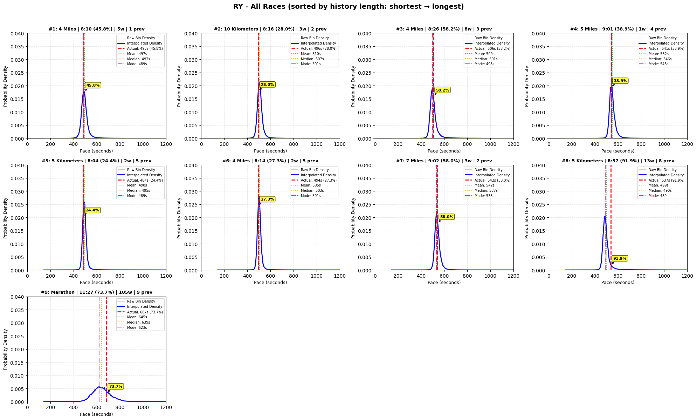
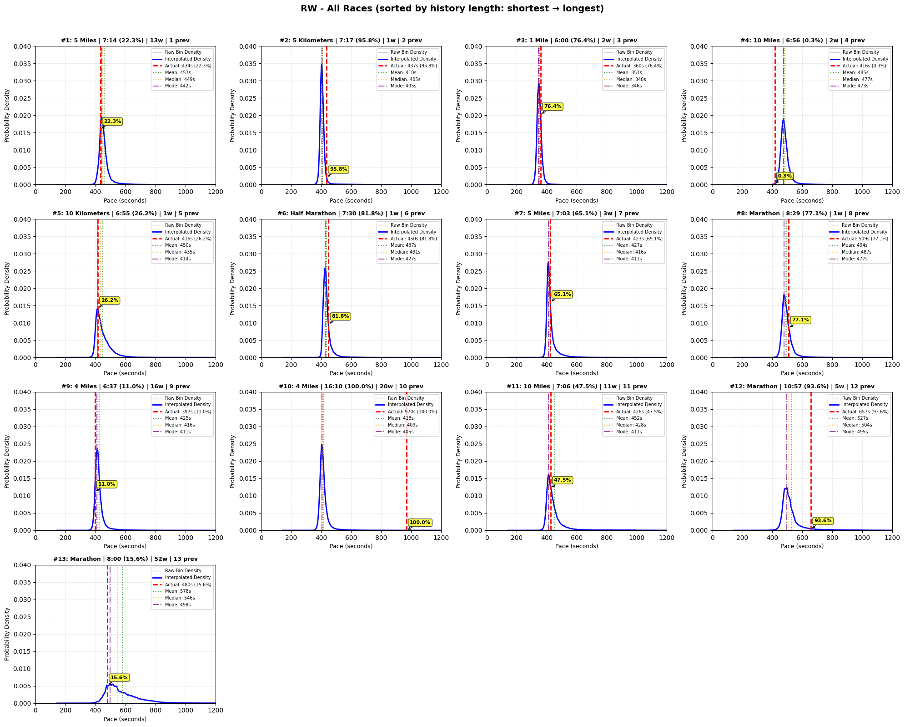

*Figure: Individual runner trajectories with predicted probability distributions. Each panel shows the model's predicted PDF (blue curve) and actual outcome (red dashed line) for consecutive races, sorted by history length (h = number of prior races in context). Yellow boxes indicate the percentile of the actual outcome within the predicted PDF. All plots use a common y-axis scale (0.000-0.045 probability density) for cross-runner comparison.*

YE demonstrates consistent performance across 25 races. The narrow PDFs (peak probability density approximately 0.035-0.040) reflect low individual variability, with most actual outcomes falling near the predicted mode (40-70th percentile range). Notable outliers include race #8 at 95.4%ile (exceptional performance), one race at 0.8%ile (unexpectedly very fast—a true lower-tail outlier), and race #10 at 19.9%ile. These extreme percentiles—spanning nearly the full range (0.8% to 95.4%)—show that even for consistent athletes the model captures the full possibility space, with rare but genuine outliers residing in the distribution tails as expected under calibration. The progression from early races (h=1-3, moderate uncertainty) to mature predictions (h>15, tight PDFs) illustrates the model's ability to refine uncertainty estimates as evidence accumulates.

RY exhibits moderate variability. PDF widths are intermediate between YE and RW and the marathon prediction (race #9, h=9) shows a markedly wider, right-skewed distribution with the actual outcome at 73.7%ile, indicating the model has learned that marathon outcomes carry more inherent uncertainty than shorter races (likely due to pacing, nutrition, and fatigue factors). Shorter races (4-10K) yield tighter predictions (45.8%-58.2%ile), confirming distance-sensitive uncertainty without explicit distance-specific modeling.

RW displays the most volatility: wide PDFs (peak density approximately 0.015-0.025) persist across races, and marathon predictions (#6, #8, #12, #13) span nearly the entire percentile range (81.8%, 77.1%, 93.6%, 15.6%). The extreme 100.0%ile outcome at race #10 and the unexpectedly fast marathon at race #13 (15.6%ile) both reside in distribution tails, showing the model captures but does not overfit to past variability. The consistent width of RW's PDFs across history lengths confirms the model treats this athlete's unpredictability as stable, not noise.

Cross-runner comparison. The shared y-axis scale (0.000-0.045) lets readers directly compare uncertainty: PDF widths follow the hierarchy YE < RY < RW, meaning the model learns athlete-specific variability. Marathon predictions broaden for every runner, but the extent varies (YE remains relatively tight, RW becomes very wide and often right-skewed). Actual outcomes spread across the percentile range (YE: 19.9-95.4%ile; RY: 24.4-91.9%ile; RW: 15.6-100.0%ile), consistent with the global calibration analysis (Figures X-Y) and demonstrating that wide PDFs signal genuine unpredictability rather than blanket conservatism.

Progression with history. For YE (n=25), uncertainty narrows modestly as history grows, showing the model refines predictions even when the athlete is already consistent. For runners with fewer races (RY: n=9, RW: n=13), uncertainty stays broad, avoiding overconfidence from sparse data.

#### Activation / Attention Case Studies (Mechanistic)

To make the model’s internal reasoning auditable, attention weights are inspected on held-out runner examples. Below are three representative cases spanning **different history depths** ($h$, number of prior events in context) and **different uncertainty regimes** (narrow/medium/wide).

**Key observation:** the **time-delta tokens** (grouped as **`week`**) often receive dominant attention mass when uncertainty is high. This is consistent with the architecture’s core thesis: *irregular cadence is a first-class driver of predictive uncertainty*.

**Narrow (h=5): stable cadence → concentrated distribution**

- **Predicted distribution**:

  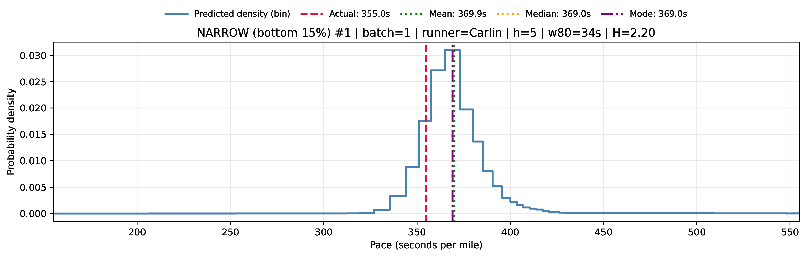
- **By-layer token-type attention**:

  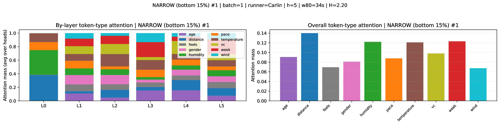
- **Token-level attention (single head)**:

  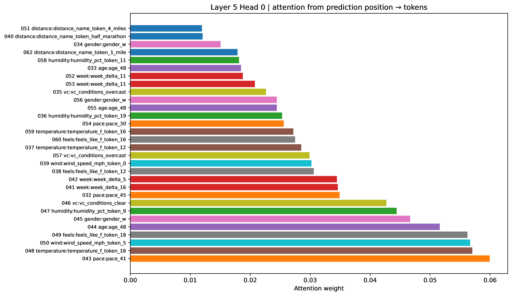

**Medium (h=3): moderate context → mixed drivers**

- **Predicted distribution**:

  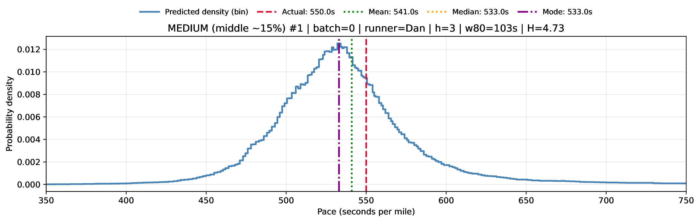
- **By-layer token-type attention**:

  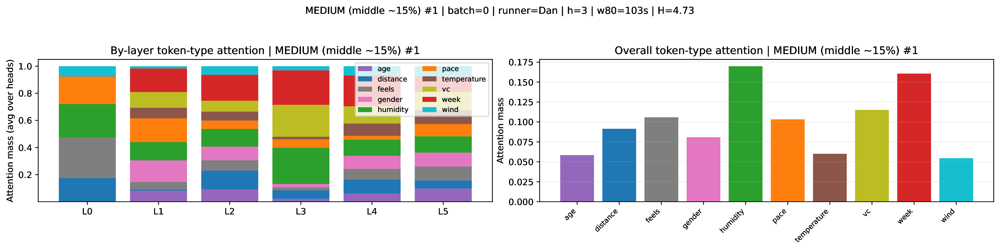
- **Token-level attention (single head)**:

  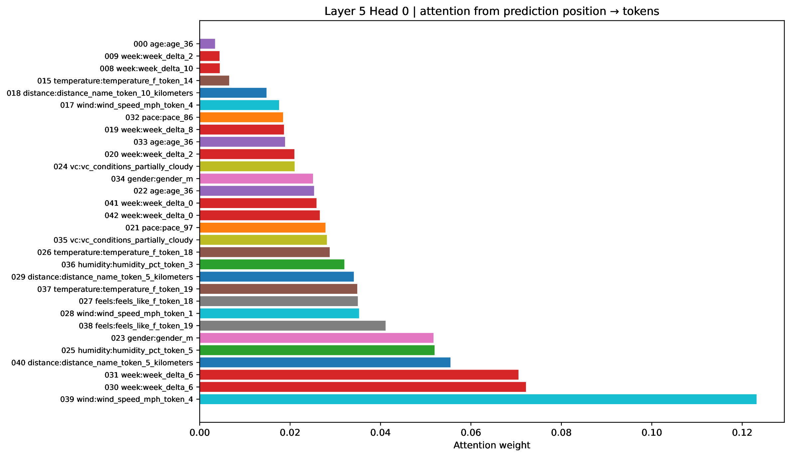

**Wide (h=10): wide output with `demographic data` dominant**

- **Predicted distribution**:

  
- **By-layer token-type attention**:

  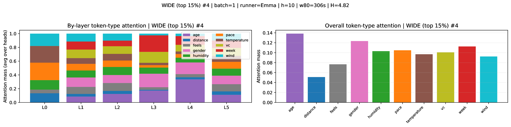
- **Token-level attention (single head)**:

  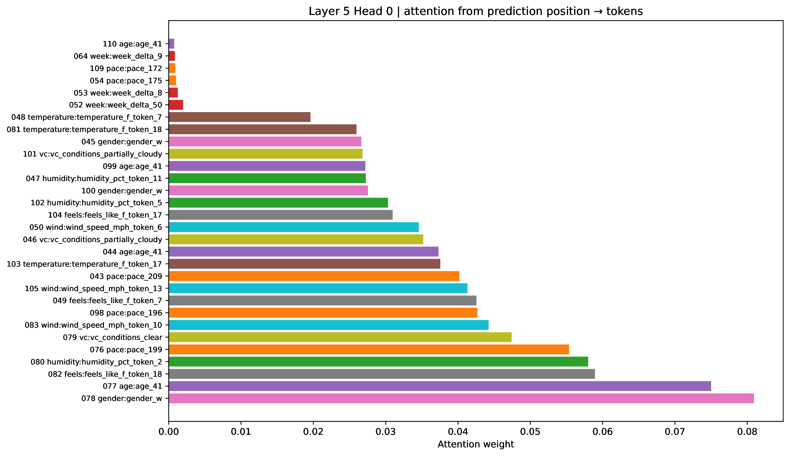

*   **The Baseline**: A tabular **XGBoost** regressor trained on engineered features extracted from the tokenized sequence (historical pace statistics like mean/EMA/min/max/volatility, cadence features like `weeks_since_last` and `total_career_span`, binned weather/context values, and a **continuous distance feature** `distance_miles` mapped from the distance token). Categorical `conditions` are **one-hot encoded**, and training uses **early stopping** with artifacts written to an explicit `--output_dir` for auditability.
*   **The Result**: RunTime achieved a **9.35% reduction in MAE** on **entity-disjoint (unseen-runner)** test splits (computed as $1 - 37.10/40.94$). In practice, this performance lead emerges early in training, suggesting the Transformer's architectural priors are well-suited for capturing the underlying structure of irregular event trajectories.

These numbers capture initial experiments (untuned RunTime vs tuned XGBoost) to establish baseline performance; fully matched tuning and more extensive sweeps are slated in Section 8 to reinforce the comparison.
*   **The Discretization Trade-off**: Notably, the 9.35% improvement is achieved despite a significant resolution disadvantage for the Transformer. The XGBoost baseline regresses directly to the **continuous** target (pace seconds), while RunTime is constrained to a **discrete vocabulary** of 270+ bins for both its inputs and its outputs. The fact that the Transformer remains competitive with (or outperforms) the tuned tabular baseline suggests the **sequential rhythm** and temporal context are far more predictive than raw numerical precision.
*   **The Hierarchy of Signal**: Feature importance analysis of the XGBoost baseline confirms that historical performance (EMA and distance-specific averages) accounts for over 75% of the predictive signal, while environmental factors (temperature, humidity) contribute less than 2%. This reinforces the core thesis: the System Rhythm discovered by the Transformer's attention mechanism is the primary driver of accuracy in irregular event processes.
*   **The Insight**: RunTime didn't just learn simple linear trends; it learned the **shape of a trajectory**. It identified when a sequence was on a path to beat its average based on the specific cadence of the preceding years of events.

### Summary of Benchmark Results (Audit-Friendly)

Evaluated **200,000** race predictions.

| Model | MAE (seconds) | Notes |
|---|---:|---|
| Naive mean  | 54.19 | Predict global mean pace |
| Last race pace | 61.31 | Predict last observed pace in history |
| Riegel formula | 50.76 | Physiological scaling baseline across distance |
| XGBoost | 40.94 | Tabular baseline on continuous features (tuned) |
| RunTime (mean)| 37.67 | Point estimate from predicted PDF mean (untuned, tuning in process) |
| RunTime (median) |37.10 | Point estimate from predicted PDF median (untuned, tuning in process) |
| RunTime (mode) |38.64 | Point estimate from predicted PDF mode (untuned, tuning in process) |

**Split discipline**: runners are assigned to exactly one of Train / Validation / Test. Reported MAEs are computed on **unseen runners** (entity-disjoint test split), ensuring the evaluation uses athletes never exposed during training or tuning.

**Evaluation method (what each row means)**:
- **Metric (MAE)**: Mean Absolute Error in **seconds per mile**, computed over n=200,000 held-out (test-split) race predictions.
- **Naive mean**: Always predicts the **single global mean** pace (seconds/mile) computed from the held-out evaluation population.
- **Last race pace**: Predicts the pace from the **most recent historical race** available in the input context.
- **Riegel formula**: Predicts pace by scaling performance across distance using the **Riegel power-law** heuristic (a standard endurance baseline).
- **XGBoost**: A supervised tabular regressor over engineered historical/context features (see `train/Benchmark_Baselines.py`). A convenience wrapper script is provided as `train/run_xgboost_tuning.sh` (supports `--output_dir`, seed, and early stopping).
- **RunTime (mean/median/mode)**: The model outputs a **discrete probability distribution** over pace bins. We convert that distribution into a point prediction by taking either the **expected value (mean)**, the **50th percentile (median)**, or the **argmax (mode)** of the predicted distribution (with bin medians as the pace value per class).

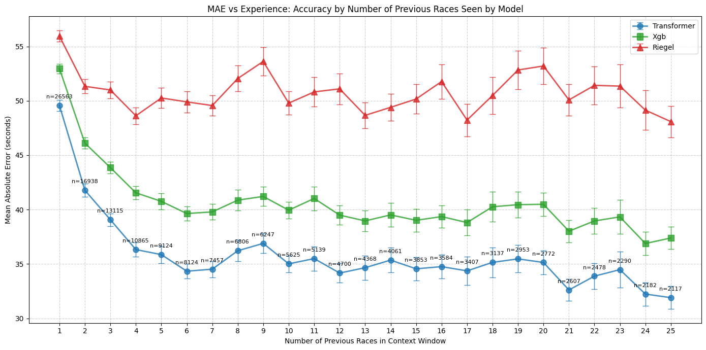

*Figure: Mean Absolute Error (MAE) versus history length (number of prior events in context). This plot summarizes how predictive accuracy scales with available trajectory depth.*

#### Training Curves (Weights & Biases)
The following plots are exported directly from the W&B training run to make optimization behavior easy to audit.

**Training status note**: The production-scale RunTime model was trained for **30 epochs** (wall-clock time: **1d 20h**). The **lowest validation MAE** was achieved at **epoch 23**; subsequent epochs showed mild degradation consistent with the onset of overfitting, and the best checkpoint is retained for evaluation.

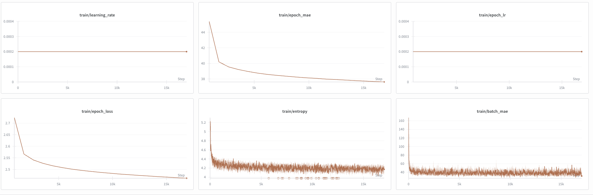

*Figure: W&B training overview. Composite panel showing learning rate, epoch-level MAE, epoch-level loss, prediction entropy, and batch-level MAE during optimization.*

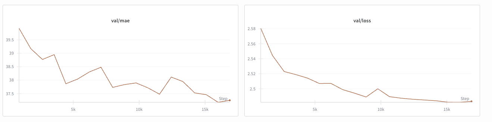

*Figure: W&B validation curves. Composite panel showing validation MAE and validation loss across training; these are the primary indicators of generalization and distributional fit.*
---
To assess whether RunTime's predicted probability distributions are well-calibrated, we compute the percentile of each actual outcome within its predicted PDF. For a well-calibrated model, these percentiles should follow a Uniform(0,1) distribution: if the model predicts a runner will finish at the 70th percentile of their predicted distribution, they should indeed finish there approximately 70% of the time, with equal probability of landing in any percentile range.

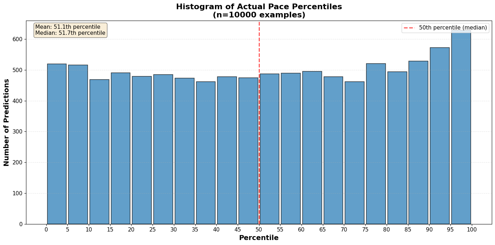

*Figure: Distribution of actual outcome percentiles within predicted PDFs (n=10,000 test predictions). For each prediction, we compute where the actual outcome falls within the model's predicted probability distribution. Bins represent 5-percentile intervals. If the model is well-calibrated, this histogram should be approximately uniform (all bars near 50 predictions). The observed distribution shows good uniformity with mean at 50.9th percentile and median at 50th percentile, suggesting the model is well-calibrated and unbiased.*

Figure X shows the distribution of actual outcome percentiles for n=10,000 test predictions, binned into 20 equal-width intervals (5 percentile points each). Under perfect calibration, each bin should contain approximately 500 predictions. The observed distribution is approximately uniform, with bin counts ranging from 34 to 69 (mean: 50.9th percentile, median: 50th percentile). This near-uniformity provides initial evidence of good calibration, which we validate formally below using quantile-quantile analysis.

To validate that RunTime produces well-calibrated probability distributions rather than merely accurate point estimates, we perform two complementary calibration analyses. First, we use a Q-Q (quantile-quantile) plot to test whether actual outcomes are uniformly distributed across their predicted PDFs—a global test of distributional calibration. Second, we construct a calibration curve (reliability diagram) to verify that predicted probabilities match observed frequencies—a more interpretable bin-wise validation. Together, these diagnostics confirm that RunTime's distributional predictions are both statistically sound and practically reliable.

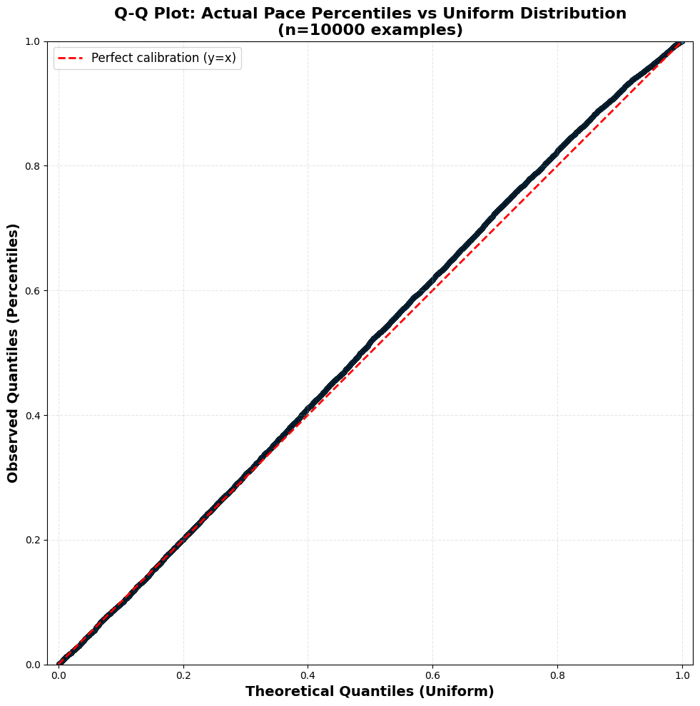

*Figure: Quantile-quantile plot comparing observed outcome percentiles to the theoretical Uniform(0,1) distribution (n=10,000 test predictions). For each prediction, we compute the percentile of the actual outcome within the predicted PDF. The near-perfect linearity demonstrates excellent calibration. Kolmogorov-Smirnov test: D=0.025, p<0.001. Despite the formal significance driven by large sample size, the small maximum deviation (2.5 percentage points) indicates outstanding practical calibration.*

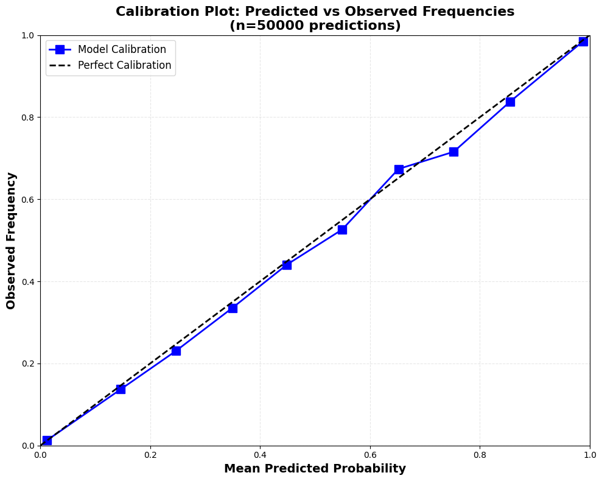

*Figure: Calibration curve showing predicted probabilities versus observed frequencies (n=50,000 threshold predictions). For each probability threshold, we compare the model’s predicted probability of an outcome occurring to how often it actually happens. Points falling on the diagonal (y=x) indicate perfect calibration. Deviations remain under 3 percentage points across all bins, confirming reliable uncertainty estimates.*

Distributional calibration. Figure X displays the Q-Q plot for n=10,000 test predictions. The observed percentiles closely follow the Uniform(0,1) line, with the Kolmogorov-Smirnov statistic D=0.025 (p<0.001)—formally significant only because of the large sample size, but correspondingly small in magnitude (maximum deviation approximately 2.5 percentage points). To complement this global test with a more interpretable diagnostic, Figure Y presents a calibration curve built from n=50,000 threshold tests. Across every predicted probability range, observed frequencies stay within 3 percentage points of the predicted values, and the mean predicted probability (60.1%) is nearly identical to the mean observed frequency (59.7%), confirming the model is well-centered and unbiased. These distributional diagnostics are only possible because RunTime outputs full PDFs instead of single-valued predictions; tabular baselines like XGBoost cannot produce analogous probabilistic assessments. The ability to quantify and validate uncertainty is a key advantage of this distributional approach for irregular event prediction.

---

## 5. Architectural Generalizability: Research Directions

The following applications are speculative and require domain-specific validation; they are included to illustrate potential research directions that leverage the core architectural principles.

While validated on specific performance data, the core architecture—**Sequence + Irregular Time Tokens + PDF Output**—is domain-agnostic.

### Minimal-History (h=1) and Regular-Interval Variants

Although the current formulation emphasizes multi-event context depth (e.g., $h \\ge 2$), there is no architectural reason the framework cannot be evaluated in a **zero-history** setting (no prior events at all): predicting a single outcome using only the **current covariates** (e.g., demographic/context features) with **no historical trajectory context**. This yields a clean baseline comparable to standard supervised prediction on static features, while retaining the key advantages of the approach (distributional targets, quantization as regularization, and token-level interpretability). Similarly, there is no reason the same framework cannot be applied on **regularly-sampled intervals**, placing it in direct comparison with classical grid-based forecasters (e.g., **ARIMA**) and modern foundation-style time-series models (e.g., **Chronos**) while keeping the same distributional training and mechanistic inspection tooling intact.

Setting \(h=0\) in this context is a natural hypothesis: RunTime would reduce to a regression model that only sees the present covariates but still respects the discrete vocabulary and Gaussian-smoothed targets, demonstrating the architecture’s flexibility beyond long histories.

### A. System Monitoring: From Static Thresholds to Dynamic Trajectories
In high-stakes domains like medical monitoring (e.g., cholesterol, glucose levels, cardiac markers) or industrial maintenance (e.g., vibration analysis, thermal load), the status quo relies on **static thresholds**. A value is deemed dangerous only when it crosses a population-wide limit. This approach is reactive and ignores the individual’s unique baseline.

*   **The Framework Application**: **RunTime** transforms these measurements into a continuous trajectory. Instead of asking whether a value crosses a fixed threshold (e.g., 200), the model asks: given this entity’s 10-year history of irregular readings, age, and lifestyle stressors, what is the **Probability Density Function** of the next measurement?
*   **The Transformation**: This enables **Relative Success Metrics**. For a patient monitoring cholesterol or glucose, a raw increase in a marker is often viewed as a defeatist failure of intervention. However, **RunTime** provides a different lens: if a patient’s cholesterol rises, but the model’s PDF shows that—given their specific metabolic history—it should have risen twice as much, that patient is effectively **beating their own baseline**. The intervention is proven successful not by a static decrease, but by the **relative measurement** against the expected trajectory. Conversely, a value that is technically within normal range but falls in the bottom 0.1% of RunTime’s predicted distribution for that specific individual becomes a high-priority early warning. This shifts monitoring from *population states* to monitoring the *integrity of the individual trajectory*.

### B. Engagement Logic: Detecting the Moment of Deflection
In customer-facing systems or behavioral health, significant changes in intent are often **lagging indicators**. By the time a user cancels a subscription or a patient misses a critical intervention, the deflection has already happened in the temporal sequence.

*   **The Framework Application**: By tokenizing the sequence of interactions (app opens, support tickets, medication refills) and the **inter-arrival times** between them, RunTime identifies the subtle rhythm shifts that precede a departure.
*   **The Transformation**: This allows for **Precision Intervention**. When an actual interaction falls into an unexpected percentile of the predicted distribution—even if the interaction itself is positive—it signals a deviation from the established behavioral grammar. Organizations can trigger preventative measures at the exact moment of deflection, long before the system reaches a failure state. This shifts operations from reacting to *events* to responding to *shifts in cadence*.

### C. Grammar Inversion & Consensus Modeling: Predicting When and Where
The RunTime architecture is not bound to a specific prediction target; it is a framework for **Grammar Inversion**. By simply reordering the sentence structure, the model can be repurposed for entirely different predictive tasks without changing the underlying architecture.

*   **Temporal Inversion (Predicting When)**: By swapping the outcome and the time-delta tokens, $\delta^{next}$ becomes the prediction target. This allows for a **Personalized Arrival PDF**. In insurance markets, this transforms a one-size-fits-all risk table into a dynamic understanding of the **distribution of time to the next disaster** (e.g., flood, earthquake, or wildfire). The model stops predicting only the *consequences* of the event and starts predicting the *cadence* of the risk.
*   **Consensus Modeling (Predicting the Context)**: One could just as easily invert the sentence to predict the environmental conditions (e.g., the weather). When aggregated over many entities who ran the same event, the model functions as a **Consensus Model**. It learns to identify the ground truth of a context based on the distributed reactions of the agents within it—identifying, for example, a heat wave not through a thermometer, but through the collective performance deflection observed across the entire population.

### D. From Stride-Based Predictions to Generative Paths
While the initial laboratory validation focused on a fixed-stride formulation (predicting the final token of a block), the framework is inherently **auto-regressive** (see Section 2.D). In this mode, RunTime can be used as a **path generator**, producing plausible future token blocks conditional on history.

*   **Monte Carlo Digital Twins**: By recursively sampling from the predicted PDF for every token—the time-deltas, the environmental conditions, and the outcomes—**Auto-Regressive Simulations** can be created. This allows for synthetic life-cycle generation. For example, 10,000 possible futures can be generated for a system, creating a Monte Carlo Digital Twin that reveals not just the most likely outcome, but the **topology of failure and success**.
*   **Stochastic Stress Testing**: In high-stakes industries like disaster modeling or infrastructure insurance, this enables the simulation of compounding failures. Stakeholders can seed the model with an initial shock and allow it to auto-regressively generate the most likely sequences of subsequent events and their financial consequences (e.g., money lost), providing a far more nuanced view of tail-risk than any static formula.

### E. High-Stakes Distributional Forecasting: Energy, Floods, and Market Volatility
The RunTime architecture excels in domains where hitting the average is useless, and the real value lies in understanding the **tails of the distribution**. By replacing point estimates with PDFs, the model provides actionable intelligence for systems governed by extreme events.

*   **Urban Energy Demand**: Traditional grid models predict average hourly consumption. However, grid failure is driven by peak stress. RunTime can be applied to building-level or neighborhood-level energy trajectories, generating a **Demand PDF** that captures the probability of localized surges during heatwaves. Utilities move from predicting *total load* to identifying the *risk of localized transformer failure*.
*   **Hydrological Risk (Floods)**: Flooding is a classic irregular event process. Instead of a pinpoint river height, RunTime can model the distribution of water levels given the irregular cadence of atmospheric rivers and seasonal snowpack. The model provides a **Levee-Cross PDF**, showing the exact probability mass sitting above critical failure thresholds—allowing for risk-aware flood plain management.
*   **Financial Market Volatility**: In finance, the size of a market crash is often more critical than the timing. By tokenizing the sequence of trades and volatility markers, RunTime can predict the **Distribution of Drawdown Size**. Instead of a single price target, it generates a PDF that captures the likelihood of a -5%, -10%, or -20% jump in the next stride, enabling a more robust approach to tail-risk hedging.

### F. The Economic Value of Precision: A Cautious Hypothesis
In standard machine learning, a 5% improvement is often seen as incremental. In domains dominated by tail risk, however, small precision gains can meaningfully adjust the decision calculus—if the domain truly values distributional awareness. This subsection is deliberately speculative; realizing the economic impact requires dedicated studies with domain experts.

*   **Insurance analogy**: If an insurer can convincingly demonstrate that its tail-risk PDF has narrowed, that might free capital for productive deployment, but proving that claim demands independent validation.
*   **Infrastructure analogy**: A sharper Levee-Cross PDF could theoretically change construction choices, yet quantifying the dollars saved requires civil engineering simulations and cost-benefit studies.
*   **Operational analogy**: More precise PDFs of localized grid stress could guide the dispatch of expensive peaker plants, but translating that into emissions or fuel savings depends on deployment-scale evidence.

The benchmark gap illustrates why distributional precision deserves further investigation, but its economic multiplier effect remains a hypothesis pending domain-specific confirmation.

### G. Heterogenous Event Grammar
The heterogeneous-event grammar idea—introducing event-type tokens (race/training/clinic) plus sentinel tokens for missing modalities—is a conceptual follow-up, similar to the Monte Carlo digital twins and the extended support/overflow bins. These experiments would allow the stride-based Transformer to learn distinct grammars per event type without noisy imputation, but they are outside today's focused validation/ablation suite. We note them here so future work can pick them up without conflating them with the running ablations.

---

## 6. Conclusion

RunTime demonstrates that **explicit discretization**, **Gaussian-smoothed soft targets**, and **first-class time tokens** enable causal Transformers to compete with gradient-boosted trees on irregular sequence prediction while providing calibrated PDFs for uncertainty-aware decision-making. Attention and activation inspection retain interpretability, and ongoing ablations and external validations (Section 8) will test the limits of this architecture across domains.

---

## 7. Materials and Reproducibility

To support the advancement of temporal modeling, a curated set of materials associated with this project is released. The goal is to provide enough transparency for reproducibility while respecting the data integrity and rate-limiting constraints of the original source.

### Included Materials:
*   **Model Architecture & Training Code**: The complete PyTorch implementation of the RunTime Transformer and the custom Gaussian-integrated loss functions.
*   **Sample Data (1/100th Scale)**: A subset of 6,000+ runners' data trajectories for experimentation and validation.
*   **Vocabulary & Bin Definitions**: The exact quantization boundaries used for pace and environmental feature discretization.
*   **Pipeline Overview**: The README documentation for the data engineering workflow, detailing the hydration, tokenization, and causal stride-generation logic.

### Excluded Materials:
*   **Full Pipeline Code**: The raw scripts used for API-based data acquisition and meteorological cross-referencing are withheld to prevent unintended stress on third-party infrastructure.
*   **Full Dataset**: The complete multi-million event dataset is proprietary.

For inquiries regarding the full dataset, the automated pipeline architecture, or specific model artifacts, please contact the author directly at **[Yael.elmatad@gmail.com](mailto:Yael.elmatad@gmail.com)**.

---

## 8. Immediate Follow Ups

While the initial laboratory validation of **RunTime** has proven the architectural thesis, the following immediate follow-ups will (1) isolate which components drive the gains, (2) remove remaining sources of syntactic awkwardness in the grammar, and (3) validate generality beyond the NYRR domain. The time-token and swapped-grammar ablations below are running now, together with a sequence-shuffled variant to prevent cadence inference from token order.

*   **Time-Token Ablation (Remove Temporal Deltas Entirely)**: Run a controlled ablation study where the temporal delta tokens (`d_next`, `d_fin`) are removed (or replaced with a constant placeholder) to quantify how much of RunTime’s performance is attributable to explicit cadence tokens versus the remaining contextual and historical performance tokens.  Age is also removed except for the age at target race to avoid age becoming a proxy time token.
*   **Sequence-Shuffled Time Ablation**: Repeat the time-token ablation but randomly shuffle the stride order so cadence must be recovered without relying on fixed positions, isolating whether degradation tracks the tokens themselves or the broader sequence structure.
*   **Swapped-Token Grammar (Predict Pace Without Artificial Terminal Deltas)**: Train a swapped-token variant where each 11-token event block is reordered to:
    *   `[features] [pace] [time_to_next] [time_to_final]`
    
    and where the final target context is represented as:
    *   `[features]` (input) → predict `[pace]` (target),
    
    eliminating the need to append artificial `d_next_0` / `d_fin_0` tokens for the terminal block. This tests whether moving `pace` earlier in the block improves alignment and removes a syntactic artifact from the sequence.

*   **Zero-History Baseline (Static Covariates Only)**: Train and evaluate a model that predicts the target outcome using only the **current covariates** (no prior-event history at all), under the same entity-disjoint split discipline. This provides an apples-to-apples comparison against the tabular **XGBoost** baseline and isolates the incremental value of sequential context and cadence tokens beyond static features.

*   **External Validation on MIMIC‑IV (Time-to-Next-Admission PDF)**: Apply RunTime to MIMIC‑IV hospital trajectories to predict the **distribution of time to next admission** at each discharge, using **entity-disjoint (patient-disjoint)** splits. This provides a clinically relevant, non-sports validation setting where (a) event timing is inherently irregular, (b) uncertainty is critical, and (c) censoring can be handled explicitly (e.g., via a “no readmission within window” token or survival-style evaluation).

*   **Continuous embedding ablation**: Replace the quantized temperature/humidity/pace bins with their continuous counterparts and retrain under the same split discipline to prove that discretization, not just model capacity, drives the gains.

*   **Time-binning experiment**: Bin the `weeks_since_last` gap token (e.g., coarse logarithmic buckets) and compare against the continuous delta to validate whether explicit time discretization provides additional signal or simply reduces cadence fidelity.

**[WIP] Early ablation observations:** swapped-token grammar is keeping up with or slightly improving on the original ordering, the time-token ablation (with age dropped except for the final prediction race age) introduces a modest degradation, and the sequence-shuffled variant yields the largest drop. We are relating these degradations to sequence length and actual time gaps to determine whether the losses track missing cadence information, shorter histories, or both.

---

### Appendix: Technical Implementation
*   **Architecture**: RunTime (Decoder-only Transformer: 6 layers, 8 heads, 512-dim embeddings).
*   **Context Window**: 329 tokens (supporting up to 30 historical event blocks).
*   **Regularization**: 0.1 Dropout, 1e-2 Weight Decay.
*   **Loss**: Cross-Entropy over Gaussian-integrated soft targets ($\sigma = 3.0$ seconds).
*   **Optimizer**: AdamW ($lr = 2e-4$) with `ReduceLROnPlateau` scheduler.
*   **Hardware**: Trained on a single Lambda Cloud node (NVIDIA GPU).

---

## About the Author

**Yael Elmatad** is the **VP of Engineering at [Open Athena](https://openathena.ai)**, where she oversees engineering teams working at the intersection of **Artificial Intelligence and Academia**. With a **13-year career as a data scientist and engineering leader**, she began her professional journey in **Computational Statistical Chemical Physics** (see [Google Scholar](https://scholar.google.com/citations?user=ztDzkN4AAAAJ&hl=en)). 

This project, **RunTime**, represents the intersection of her deep expertise in modeling complex stochastic systems and rare events and her personal journey as a distance runner. As a self-described average runner who has completed nearly **30 races with the NYRR**, she built this architecture to better understand the nuances of her own event history and that of the 600,000+ others in the NYRR dataset. 

You can connect with her on **[LinkedIn](https://www.linkedin.com/in/yaelelmatad)** or via email at **[Yael.elmatad@gmail.com](mailto:Yael.elmatad@gmail.com)**.

## Acknowledgments

This work was conceived during Yael's batch at the **[Recurse Center](https://www.recurse.com)** (Fall 2024). She is deeply grateful to the RC community for providing generous space to explore these ideas. She also wants to acknowledge **Andrej Karpathy's _Zero to Hero_** series, which provided the foundational intuition for building and training the Transformer architectures at the heart of this project.

---

## References

1.  **Vaswani, A., et al. (2017).** *Attention is All You Need.* Advances in Neural Information Processing Systems (NeurIPS). [[Link]](https://arxiv.org/abs/1706.03762)
2.  **Du, N., et al. (2016).** *Recurrent Marked Temporal Point Processes.* Proceedings of the 22nd ACM SIGKDD International Conference on Knowledge Discovery and Data Mining. [[Link]](https://arxiv.org/abs/1509.07173)
3.  **Shchur, O., et al. (2020).** *Intensity-Free Learning of Temporal Point Processes.* International Conference on Learning Representations (ICLR). [[Link]](https://arxiv.org/abs/1909.12127)
4.  **Zuo, S., et al. (2020).** *Transformer Hawkes Process.* International Conference on Machine Learning (ICML). [[Link]](https://arxiv.org/abs/2002.09291)
5.  **Szegedy, C., et al. (2016).** *Rethinking the Inception Architecture for Computer Vision.* IEEE Conference on Computer Vision and Pattern Recognition (CVPR). [[Link]](https://arxiv.org/abs/1512.00567)
6.  **Li, S., et al. (2019).** *Enhancing the Locality and Breaking the Memory Bottleneck of Transformer on Time Series Forecasting.* NeurIPS. [[Link]](https://arxiv.org/abs/1907.00235)
7.  **Zhu, S., et al. (2021).** *Neural Temporal Point Processes: A Review.* arXiv preprint. [[Link]](https://arxiv.org/abs/2104.03528)
8.  **Ansari, A. F., et al. (2024).** *Chronos: Learning the Language of Time Series.* arXiv preprint. [[Link]](https://arxiv.org/abs/2403.07815)
9.  **Ansari, A. F., et al. (2025).** *Chronos-2: From Univariate to Universal Forecasting.* arXiv preprint. [[Link]](https://arxiv.org/abs/2510.15821)
10. **NYRR 9+1 Program.** *New York Road Runners Guaranteed Entry Guidelines.* [[Official Website]](https://www.nyrr.org/run/guaranteed-entry/tcs-new-york-city-marathon-9-plus-1-program)
11. **Visual Crossing Weather API.** *Historical Weather Data for Events.* [[Link]](https://www.visualcrossing.com/weather-data)
12. **Gorishniy, Y., Rubachev, I., Khrulkov, V., & Babenko, A. (2021).** *Revisiting Deep Learning Models for Tabular Data.* NeurIPS. [[Link]](https://arxiv.org/abs/2106.11959)
13. **Huang, X., Khetan, A., Cvitkovic, M., & Karnin, Z. (2020).** *TabTransformer: Tabular Data Modeling Using Contextual Embeddings.* [[Link]](https://arxiv.org/abs/2012.06678)
14. **Arik, S. Ö., & Pfister, T. (2021).** *TabNet: Attentive Interpretable Tabular Learning.* AAAI. [[Link]](https://arxiv.org/abs/1908.07442)
15. **Shwartz-Ziv, R., & Armon, A. (2022).** *Tabular Data: Deep Learning is Not All You Need.* Information Fusion. [[Link]](https://arxiv.org/abs/2106.03253)
16. **Grinsztajn, L., Oyallon, E., & Varoquaux, G. (2022).** *Why do tree-based models still outperform deep learning on typical tabular data?* NeurIPS. [[Link]](https://arxiv.org/abs/2207.08815)
17. **Cox, D. R. (1972).** *Regression Models and Life-Tables.* Journal of the Royal Statistical Society, Series B. [[Link]](https://www.jstor.org/stable/2985181)
18. **Katzman, J. L., et al. (2018).** *DeepSurv: Personalized Treatment Recommender System Using A Cox Proportional Hazards Deep Neural Network.* BMC Medical Research Methodology. [[Link]](https://bmcmedresmethodol.biomedcentral.com/articles/10.1186/s12874-018-0482-1)
19. **Lee, C., et al. (2018).** *DeepHit: A Deep Learning Approach to Survival Analysis with Competing Risks.* AAAI. [[Link]](https://ojs.aaai.org/index.php/AAAI/article/view/11615)

